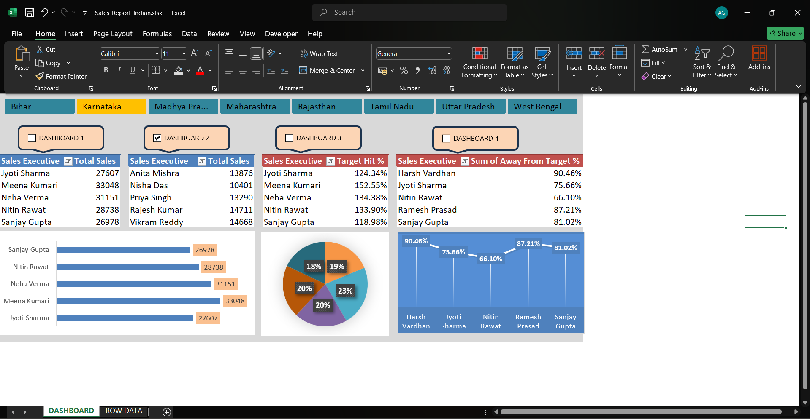

# Sales Report Analysis (Excel)

This project analyzes sales performance of 150 sales executives across Indian regions using Microsoft Excel.

## 📁 Files in this Repository  ## Dashboard Preview  

- **Sales_Report_Indian.xlsx** → Base dataset with sales data of 150 employees.
- **README.md** → Project documentation (this file).

## 🔑 KPIs and Calculations
- Target Hit % and Away From Target % (rounded to 2 decimals)
- Difference = Total Sales − Target
- Avg Sales/Day (Day1–Day5)

## 📊 Insights
- Top 5 performers (highest target achievement %)
- Bottom 5 performers (lowest target achievement %)
- Region-wise sales contribution
- Sales trend across 5 days

## 🧭 How to Use
1. Download the Excel file.
2. Explore the "ROW DATA" sheet for raw data.
3. Create PivotTables for:
   - Region-wise sales
   - Target vs Total Sales
   - Top 5 / Bottom 5 performers
4. Add charts (Bar, Pie, Line) and slicers to build an interactive dashboard.

## 🛠️ Tools Used
- Microsoft Excel (Data Cleaning, PivotTables, Charts)

## 📜 License
MIT License - feel free to use and modify this project.
